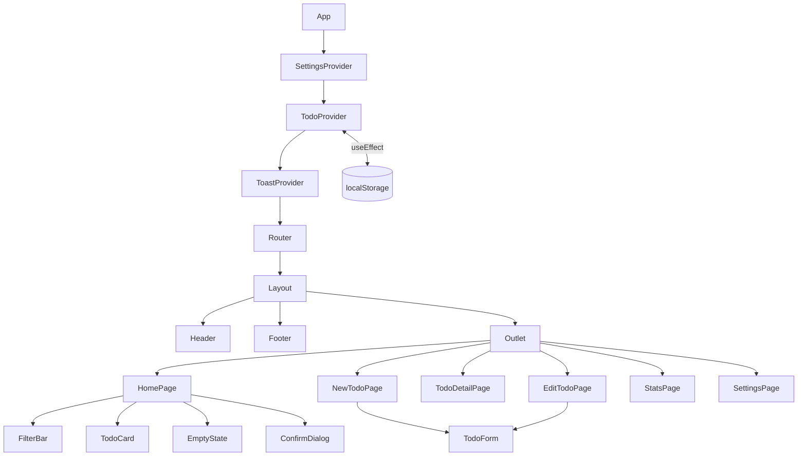

# ✅ Việc Cần Làm — Todo App

Bài tập cá nhân môn **Web UI Programming**. Ứng dụng quản lý công việc viết bằng **React 19 + TypeScript + Vite**, có routing, lưu localStorage, responsive, dark mode, hai ngôn ngữ (Việt/Anh), PWA chạy offline và unit test.

> **Họ tên:** … · **MSHV:** … · **Lớp:** …
> **Demo:** https://… · **Video:** https://…

---

## 1. Tính năng

| Nhóm | Chi tiết |
|---|---|
| CRUD | Thêm (form đầy đủ + ô thêm nhanh), xem chi tiết, sửa, xóa (có hộp xác nhận + **Hoàn tác**) |
| Trạng thái | Đánh dấu hoàn thành / bỏ đánh dấu, đánh dấu tất cả, xóa việc đã xong |
| Lọc & tìm kiếm | Lọc Tất cả / Đang làm / Đã xong (lưu trên URL `?filter=`), lọc theo danh mục, tìm kiếm có debounce |
| Sắp xếp | Thủ công (**kéo thả**), cũ nhất, hạn chót, độ ưu tiên |
| Thuộc tính | Tiêu đề, mô tả, độ ưu tiên (thấp/TB/cao), danh mục (gợi ý tự động), hạn chót, cảnh báo **quá hạn** |
| Thống kê | 4 thẻ số liệu, vòng tiến độ, biểu đồ thanh theo độ ưu tiên và danh mục |
| Cài đặt | Chủ đề Sáng/Tối/Theo hệ thống, ngôn ngữ, xuất/nhập JSON, dữ liệu mẫu, xóa toàn bộ |
| Lưu trữ | `localStorage`, tự đồng bộ giữa các tab trình duyệt |

## 2. Đối chiếu với yêu cầu đề bài

| Yêu cầu | Cách đáp ứng |
|---|---|
| Flexbox / Grid | Header, card, form dùng Flexbox; filter bar, thống kê, form grid dùng CSS Grid |
| Responsive 3 mức | `< 768px`: nav thành tab bar dưới đáy, modal dạng bottom sheet · `768–1024px`: lưới 2 cột · `> 1024px`: đầy đủ, thống kê 3 cột |
| ≥ 3 trang | Home, New, Detail, Edit, Stats, Settings, 404 (7 màn hình) |
| Component tái sử dụng | `Header`, `Footer`, `Button`, `Modal`/`ConfirmDialog`, `TodoCard`, `TodoForm`, `FilterBar`, `EmptyState`, `PriorityBadge`, `Icon` |
| Sự kiện click, input, hover, scroll | Click (nút, checkbox), input (form, tìm kiếm), hover (card nổi lên, hiện action), scroll (header đổ bóng, nút lên đầu trang) |
| Form + validation | `TodoForm`: bắt buộc, độ dài min/max, hạn chót không ở quá khứ; lỗi hiển thị realtime, `aria-invalid`, tự focus field lỗi |
| State management | `useReducer` + Context (`TodoContext`), `useState` cho UI state |
| localStorage | Todos và cài đặt đều được lưu, đọc lại khi refresh |
| Router | React Router v7, route động `/todo/:id` và `/todo/:id/edit` |
| Animation | Fade chuyển trang, slide-in card, pop checkbox, modal/toast, shake khi lỗi, vòng tiến độ; tôn trọng `prefers-reduced-motion` |
| Dark mode | Có, 3 chế độ, không nháy màu khi tải trang |
| Accessibility | Semantic HTML (`header/nav/main/footer/article/dl`), skip link, label cho mọi input, `aria-*`, focus trap trong modal, màu đạt WCAG AA |

**Bonus:** TypeScript · Vitest + React Testing Library (21 test) · PWA (manifest + service worker) · i18n Việt/Anh · Code splitting với `React.lazy` + chunk vendor riêng · CI/CD GitHub Actions.

## 3. Chạy dự án

```bash
npm install
npm run dev        # http://localhost:5173
npm test           # chạy unit test
npm run build      # build production vào dist/
npm run preview    # xem bản build (service worker chỉ chạy ở bản này)
```

Yêu cầu Node.js ≥ 20.

## 4. Cấu trúc thư mục

```
src/
├── components/      # Component tái sử dụng (Button, Modal, TodoCard, TodoForm, Layout...)
├── pages/           # Mỗi route một trang (lazy load)
├── context/         # TodoContext (useReducer), SettingsContext (theme + i18n), ToastContext
├── hooks/           # useDebounce, useScrolled, useDeleteWithUndo
├── utils/           # Reducer thuần, validation, lọc/sắp xếp/thống kê, localStorage
├── i18n/            # Bản dịch vi/en
├── test/            # Unit test + UI test
├── types.ts
├── App.tsx          # Khai báo route
└── index.css        # Design tokens, component styles, responsive
public/              # favicon, icon PWA, manifest, sw.js
```

## 5. Kiến trúc



**Luồng dữ liệu:** Component gọi `dispatch({ type: 'add' | 'toggle' | ... })` → `todoReducer` (hàm thuần) trả về state mới → Context phát state xuống các trang → `useEffect` ghi vào `localStorage`.

**Routes:**

| Path | Trang |
|---|---|
| `/` | Danh sách công việc |
| `/new` | Thêm công việc |
| `/todo/:id` | Chi tiết (route động) |
| `/todo/:id/edit` | Sửa |
| `/stats` | Thống kê |
| `/settings` | Cài đặt |
| `*` | 404 |

## 6. Deploy

**Vercel / Netlify** (khuyến nghị, dễ nhất): import repo từ GitHub, framework = Vite, build `npm run build`, output `dist`. File `vercel.json` và `public/_redirects` đã cấu hình để refresh ở `/todo/abc` không bị 404.

**GitHub Pages** (tự động qua GitHub Actions): vào *Settings → Pages → Source* chọn **GitHub Actions**. Mỗi lần push lên `main`, workflow `.github/workflows/ci-deploy.yml` sẽ lint → test → build → deploy. Link: `https://<username>.github.io/<tên-repo>/`.
